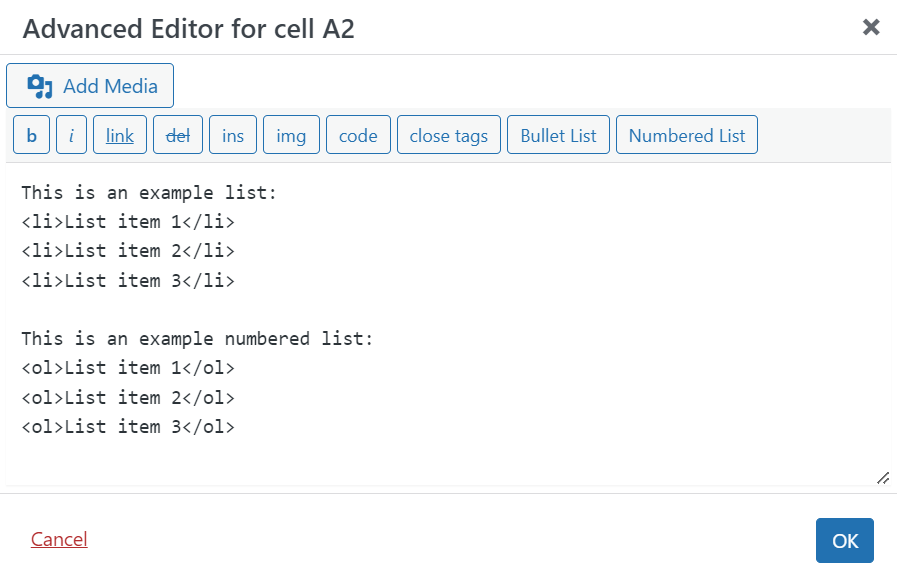

# TablePress Advanced Editor Extension

TablePress Advanced Editor Extension is a WordPress plugin that extends the TablePress plugin by adding additional functionality to the Advanced Editor modal. This extension provides quick buttons for inserting bullet lists and numbered lists directly into the Advanced Editor.

[TablePress](https://tablepress.org/) is the most popular and highest-rated table plugin for [WordPress](https://wordpress.org). TablePress is developed and maintained by "Tobias Bäthge". Please visit [TablePress](https://tablepress.org/) to find out more about this amazing plugin. 

## Features

- Adds "Bullet List" and "Numbered List" buttons to the Advanced Editor in TablePress.
- Directly inserts HTML list tags (`<ol>`, `<li>`) into the table cell content.
- Works seamlessly with both the Quicktags and TinyMCE editors within the TablePress Advanced Editor modal.

## Requirements

- WordPress 6.0 or higher
- TablePress 2.4 or higher (Tested with v2.4.2)

## Installation

1. **Upload the Plugin**:
   - Download the plugin files and upload the entire `tablepress-advanced-editor-extension` directory to the `/wp-content/plugins/` directory.

2. **Activate the Plugin**:
   - Activate the plugin through the 'Plugins' menu in WordPress.

3. **Ensure TablePress is Installed**:
   - Make sure the TablePress plugin is installed and activated.

## Usage

1. **Navigate to TablePress**:
   - Go to the TablePress section in your WordPress admin panel.

2. **Edit a Table**:
   - Edit an existing table or create a new table.

3. **Open the Advanced Editor**:
   - Click on a cell and open the Advanced Editor to access the enhanced editor.

4. **Use the New Buttons**:
   - Use the "Bullet List" and "Numbered List" buttons in the Advanced Editor toolbar to insert list HTML tags into the table cell content.

## Screenshots

1. **Advanced Editor with Bullet List and Numbered List Buttons**
   

## Frequently Asked Questions

### Q: Does this plugin work without TablePress?
A: No, this plugin is an extension for the TablePress plugin and requires it to be installed and activated.

### Q: Does this plugin require TablePress Premium lisence?
A: No, this plugin will work with the free version of TablePress and with TablePress paid versions.

### Q: Can I customize the inserted list HTML?
A: Currently, the plugin inserts basic `<ol>` and `<li>` tags. You can modify the JavaScript file (`custom-quicktags.js`) if you need customized output.

### Q: How do I style the list tags?
A: As with all TablePress custom styling, you will need to use the Custom CSS area found in the TablePress Plugin Option section to customize the style of the lists.

## Changelog

### 1.0.0
- Initial release
- Added "Bullet List" and "Numbered List" buttons to the TablePress Advanced Editor.

## Support

If you have any questions or need support, please open an issue on the [GitHub repository](https://github.com/reactivewebstudio/tablepress-advanced-editor-extension/issues).

